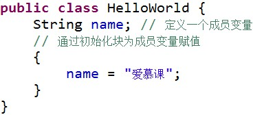
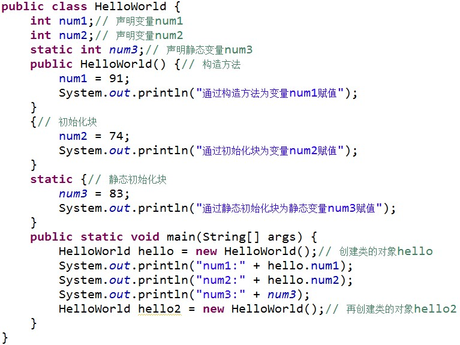
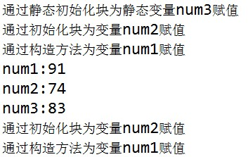
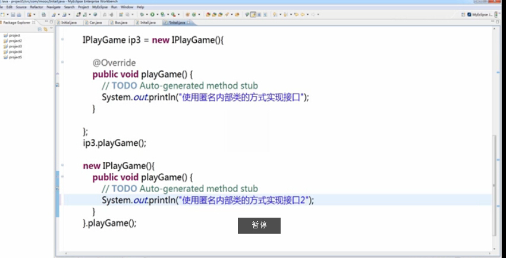
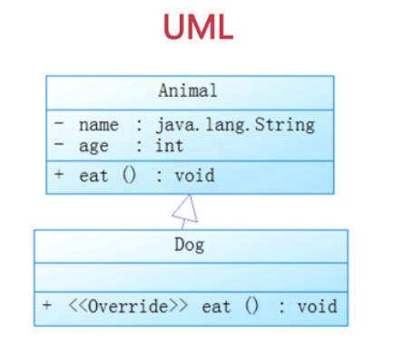

# java入门第二季 #

##类和对象
- 类是模子，确定对象拥有的属性与方法
> 类是对象的类型
> 具有相同属性和方法的集合
> 一个类可以对应多个对象

- 属性是对象拥有的各种特征
- 方法是对象执行的操作
##如何定义Java中的类
- 定义一个类的步骤
	1. 定义类名 NB.类型首字母要大写
	2. 定义类的属性
	3. 定义类的方法
##如何使用java中的对象

- 使用对象的步骤

	1. 创建对象
		> 类名 对象名 = new 类名();
		> new后面的类名其实是类的构造方法；

	2. 使用对象  
	
		> 对象名.属性 来引用对象的属性
## 成员变量与局部变量
- 成员变量
	>在类中定义，用来描述对象将拥有什么

- 局部变量
	>在类的方法中定义，在方法中临时保存数据

- 成员变量与局部变量的区别
	- 作用域不同  
		>成员变量可以被类中的所有方法使用及与该类相关的其他类使用，而局部变量只允许在自己的方法中使用。
	- 初始值不同
		>- java会给成员变量一个初始值；
		>- java不会给局部变量赋一个初始值；
	- 同一个方法中不允许有同名局部变量；在不同的方法中，可以有同名局部变量；
	- 两类变量同名时，局部变量更有优先级，也叫就近原则；
##Java中的构造方法
构造方法名称与类名相同，且没有返回值；

有参的构造方法可以给对象中的成员变量赋初值。

###NB.

- 当有指定构造方法，无论是有参的还是无参的构造方法，都不会自动添加无参的构造方法；  

##Java中的static

- 使用之静态变量
Java 中被 static 修饰的成员称为静态成员或类成员。它属于整个类所有，而不是某个对象所有，即被**类的所有对象所共享**。静态成员可以使用类名直接访问，也可以使用对象名进行访问。

- 使用之静态方法

	1.** 静态方法中**可以直接调用同类中的静态成员，但不能直接调用非静态成员。
	2. 如果希望在静态方法中调用非静态变量，可以通过创建类的对象，然后通过对象来访问非静态变量
	3. 在**普通成员方法中**，则可以直接访问同类的非静态变量和静态变量，

- 使用之静态初始化块

	Java 中可以通过初始化块进行数据赋值。如：
	
	
	在类的声明中，可以包含多个初始化块，当创建类的实例时，就会依次执行这些代码块。如果使用 static 修饰初始化块，就称为静态初始化块。
	需要特别注意：**静态初始化块只在类加载时执行，且只会执行一次，同时静态初始化块只能给静态变量赋值，不能初始化普通的成员变量。**
	我们来看一段代码：
	
	
	运行结果：
	
	通过输出结果，我们可以看到，程序运行时静态初始化块**最先**被执行，然后执行普 通初始化块，最后才执行构造方法。由于静态初始化块**只在类加载时执行一次**，所以当再次创建对象 hello2 时并未执行静态初始化块。

##什么是Java中的封装

- 概念   
	将类的信息隐藏在内部，而不允许外部程序直接访问，而通过该类提供的方法来实现对隐藏信息的操作和范文。

- 好处

 1. 只能通过规定的方法访问数据
 2. 隐藏类的实例细节，方便修改和实现。

- 封装的实现步骤  

	1. 修改属性的可见性-->修改为private
	2. 创建getter/setter方法，用于属性的读写
	3. 在getter/setter中加入控制语句

Java web开发重点bean中的属性应为private；
##使用包管理Java中的类
- 包的作用
	- 管理Java文件
	- 解决同名文件冲突

- 定义包

Java系统中的包
	- java.lang 包含java语言基础的类
	- java.util 包含java语言中各种工具类
	- java.io 包含输入、输出相关功能的类
	
NB.包的命名规范是全小写字母拼写的。

##Java中的访问修饰符
|	访问修饰符	|	本类	|	同包	|	子类	|	其他		|
| :---:| :---:| :---:| :---:| :---:|
|private|√||||
|默认|√|√|||
|protected|√|√|√||
|public|√|√|√|√|

##Java 中的this关键字

- this 关键词代表当前对象
	- this.属性操作当前对象
	- this.方法操作当前方法
##什么是Java中的内部类
###成员内部类

1. Inner 类定义在 Outer 类的内部，相当于 Outer 类的一个成员变量的位置，Inner 类可以使用任意访问控制符，如 public 、 protected 、 private 等
2. Inner 类中定义的 test() 方法可以直接访问 Outer 类中的数据，而不受访问控制符的影响，如直接访问 Outer 类中的私有属性a
3. 定义了成员内部类后，必须使用外部类对象来创建内部类对象，而不能直接去 new 一个内部类对象，即：内部类 对象名 = 外部类对象.new 内部类( );
4. 外部类是不能直接使用内部类的成员和方法滴可先创建内部类的对象，然后通过内部类的对象来访问其成员变量和方法。
5. 如果外部类和内部类具有相同的成员变量或方法，内部类默认访问自己的成员变量或方法，如果要访问外部类的成员变量，可以使用 this 关键字。

###静态内部类
静态内部类是 static 修饰的内部类，这种内部类的特点是

1. 静态内部类不能直接访问外部类的非静态成员，但可以通过 new 外部类().成员 的方式访问 
2. 如果外部类的静态成员与内部类的成员名称相同，可通过“类名.静态成员”访问外部类的静态成员；如果外部类的静态成员与内部类的成员名称不相同，则可通过“成员名”直接调用外部类的静态成员
3. 创建静态内部类的对象时，不需要外部类的对象，可以直接创建 内部类 对象名= new 内部类();
	
###方法内部类

方法内部类就是内部类定义在外部类的方法中，方法内部类只在该方法的内部可见，即只在该方法内可以使用。

###Java中的继承
###继承
- Java中的继承是单继承，就像生活中只有一个亲爹
-  继承的好处
	1. 子类拥有父类所有的属性和方法
	2. 实现代码复用 父类实现了一些功能，而子类继承了父类，就可以实现代码的复用
- 语法规则

		class 子类 extends 父类
###Java中方法的重写

子类对继承父类的方法不满意，可以重写父类继承的方法，当调用时会优先调用子类的方法。

- 语法规则：
	- 返回值类型
	- 方法名
	- 参数类型及个数

	都要与父类继承的方法**相同**，才叫**方法的重写**，也就是override

###Java中的继承初始化顺序

1. 构造方法中的初始化：先初始化父类对象再初始化子类对象
2. 属性的初始化：先初始化对象中属性，再执行构造方法中的初始化
3. **总结**：先初始化父类的属性，再执行父类的构造方法；然后再对子类的属性进行初始化，再对子类的构造方法进行初始化；

###Java中final的使用
final可以修饰

1. 类 该类不允许被继承
2. 方法 该方法不允许被覆盖（重写）
3. 属性 该类的属性不会进行隐式的初始化（类的初始化属性必须有值）或者构造方法中赋值（但只选其一）
4. 变量 该变量的值只能赋一次值，即为常量

###Java中super的使用

- 在对象的内部使用，可以代表父类对象

- 子类的构造的过程当中必须调用其父类的构造方法，`super();`写与不写效果是一样的。
但如果写了的话，必须放在构造方法中的第一行。
- 如果子类的构造方法中没有显示调用父类的构造方法，则系统默认调用父类无参的构造方法。
- 如果显示调用构造方法，必须在子类构造方法中的第一行。

- 如果子类构造方法中既没有显式调用父类的构造方法，而父类又没有无参的构造方法，则编译出错。解释：若父类有有参的构造方法，则子类在初始化对象的时候不会调用父类无参的构造方法，只会调用有参的构造方法，而子类此时会隐式地调用父类无参的构造方法。则编译出错。

###Java中的Object类

Object类是所有类的父类，其方法可以被所有子类调用。常用的方法有：

- toString()方法
	- 在Object类里面定义toString方法时，返回对象的哈希code码（对象地址字符串），可以通过重写toString()方法表示对象的属性，右键-->source中,GeneratetoString
- equals()方法
	- 比较的是对象的引用是否指向同一块内存地址，而不是两个对象的值是否相同
	- 若要比较两个对象的值是否相同，可以通过重写实现。
	- Generate hasCode() and equals()
	- `==`与`equals()`的区别

###Java中的多态

对象的多种形态

- 引用的多态
	- 父类的引用可以指向本类的对象
	- 父类的引用可以指向子类的对象
	
			Animal obj1 = new Animal();//父类的引用可以指向本类的对象
			Animal obj2 = new Dogs();//父类的引用可以指向子类的对象

但是不允许有子类的引用指向父类的对象，如：
			Dog obj3 = new Animal(); //这是不允许的

- 方法的多态
	- 创建本类对象，调用的方法为本类对象
	- 创建子类对象，调用的方法为子类重写的方法或者继承的方法

同样都是父类引用，当我们指向不同的对象的时候，调用方法执行的是不同的方法。  
NB.子类中特有的方法，不能通过父类的引用调用。如：

		Animal obj2 = new Dogs();//父类的引用可以指向子类的对象
		obj2.watchDoor();//watchDoor()方法为Dog类独有的，不能通过Animal类的引用调用该方法
**继承是多态的实现基础** 

###多态中的引用类型转换

- 向上类型转换(隐式/自动类型转换)，从小类型到大类型的转换
	- 无风险的，例如将杯子里的水倒到水壶里面
- 向下类型转化(强制类型转换)，是大类型到小类型
	- 是存在风险的，例如将水壶里面的水倒到杯子里面
- 可以使用instanceof运算符，来解决引用对象的类型，避免类型转换的安全性问题
	
		Dog dog = new Dog();
		Animal animal = dog;//自动类型转换，向上类型转换
		Dog dog2 = animal;//向下类型转换，存在风险，提示出错

可以强制转换
	
		Dog dog = new Dog();
		Animal animal = dog;//自动类型转换，向上类型转换
		Dog dog2 = (Dog)animal;//向下类型转换，存在风险
 
见下

		Dog dog = new Dog();
		Animal animal = dog;//自动类型转换，向上类型转换
		Dog dog2 = (Dog)animal;//向下类型转换，存在风险
		Cat cat = (Cat)animal;//编译时是Cat类型的，但由于开辟的是Dog类型的内存空间，因此运行的是Dog类型

此时可以使用instanceof运算符避免类型转换的安全性问题

		Dog dog = new Dog();
		Animal animal = dog;//自动类型转换，向上类型转换
		Dog dog2 = (Dog)animal;//向下类型转换，存在风险
		if(animal instanceof Cat)
			Cat cat = (Cat)animal;
		else
			System.out.print("无法进行类型转换")
		//如果对象中含有Cat类型的元素，则进行转换，否则不进行转换

最终可写为

		Dog dog = new Dog();
		Animal animal = dog;//自动类型转换，向上类型转换

		if(animal instanceof dog)
			Dog dog2 = (Dog)animal;//向下类型转换，存在风险
		else
			System.out.println("无法对Dog进行类型转换")

		if(animal instanceof Cat)
			Cat cat = (Cat)animal;
		else
			System.out.println("无法对Cat进行类型转换")
		//如果对象中含有Cat类型的元素，则进行转换，否则不进行转换

###Java中的抽象类

关键字 abstract

- 应用场景
	- 在某些场景下，某个父类只知道子类应该包含怎样的方法，但无法确切知道这些子类如何实现这些方法。 约束子类必须有某些方法，而不关系其具体实现
	- 从多个具有相同特征的类中抽象出一个抽象类，以这个抽象类作为子类的模板，从而避免了子类设计的随意性。

限制规定子类必须实现那些方法，而不关心起具体实现

- 抽象类定义顺序应为：abstract class 

		 abstract class Animal { abstract void grow(); }
###Java中的接口 interface关键字
- 接口可以理解为一种特殊的类，由公共常量以及公共的抽象方法组成
- 类是一种具体实现体，而接口定义了某一批类所需要准守的规范，接口不关心这些类的内部数据，也不关心这些类中方法的实现细节，它只规定这些类里必须提供某些方法

- 基本语法

	- [修饰符] abstract interface 接口名[	extends 父接口1，父接口2]{
		零个到多个常量定义……
		零个到多个抽象方法定义……}
	- 修饰符一般为public关键字，因为接口都是要被调用的。
	- 由于接口都是抽象方法，因此需要abstract关键字，若不写，系统会自动加上
	- 接口中的属性都为常量，即使定义时不添加public static final 修饰符，系统也会自动加上
	- 接口中的方法为抽象方法，总是使用public abstract修饰符，系统也会自动加上

- 使用接口 implements
- 
	- 如果准守了接口，就必须使用接口中的抽象方法。
	- 声明中不能有方法体
	- 定义方法geta()代码为：`void geta() ;`
	

- 通过匿名内部类使用接口
	- 两种实现方式
	- 记得使用`;`

###UML简介

- 常用UML图
	- 用例图The Use Case Diagram
		- 以可视化的方式，表达系统如何满足所收集的业务规则，以及特定的用户需求等信息
		- 描述什么角色需要什么样的功能
	- 序列图 The Sequence Diagram
		- 用于按照交互发生的一系列顺序，显示对象之间的这些交互
	- 类图
		- The Class Diagrm
		- UML类图、业务逻辑和所有支持结构一同被用于定义全部的代码结构

其中`-`表示私有，`+`表示公有

建模工具有Visio、Rational Rose(from IBM)、PowerDesign

###	项目分析
1. 数据模型分析
	1. 通过对现实世界的事与物主要特征的分析、抽象，为信息系统的实施提供数据存储的数据结构以及相应的约束。
	2. 数据结构的组成：操作(方法)、属性

2. 业务模型分析
	1. 在设计应用程序之前，应该明确该应用模型必须执行哪些业务
3. 显示和流程分析
	1. 显示：用户可是看到的信息提示界面
	2. 流程：显示信息的执行过程、步骤

 
	 

